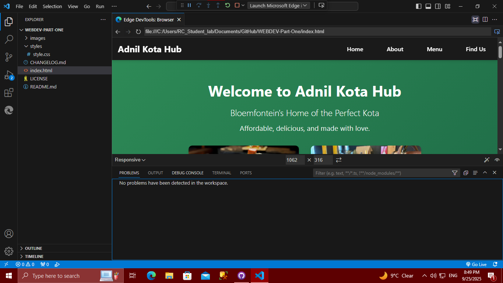
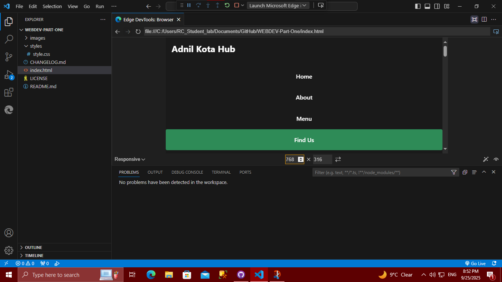
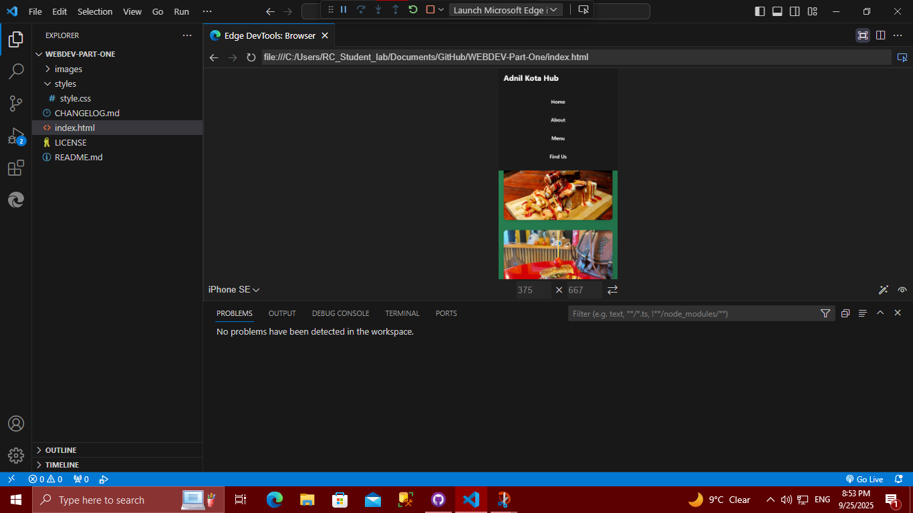

# WEBDEV-Part-One 
# Adnil Kota Hub Website - Complete Web Development Project

## Project Overview
**WEBDEV-PART-ONE**  
This repository contains the complete website for Adnil Kota Hub, a fast-food restaurant specializing in authentic South African kotas located in Bloemfontein CBD. This project represents the complete three-part web development assignment including HTML foundation, CSS styling, and JavaScript functionality with SEO optimization.

## Project Structure
WEBDEV-Part-One/
├── images/ # Product and website images
│ ├── Kotaone.jpeg # Hero image 1 - delicious kota closeup
│ └── Kotatwo.jpeg # Hero image 2 - additional kota showcase
├── scripts/ # JavaScript functionality
│ └── validation.js # Form validation and interactive features
├── styles/ # CSS styling and responsive design
│ └── style.css # Main stylesheet with responsive design
├── enquiry.html # Business enquiries and catering form
├── contact.html # General contact and message form
├── index.html # Main homepage with menu and information
├── robots.txt # SEO - Search engine instructions
├── sitemap.xml # SEO - Website structure for search engines
├── desktop-view.png # Responsive design evidence - desktop
├── tablet-view.png # Responsive design evidence - tablet
├── mobile-view.png # Responsive design evidence - mobile
├── CHANGELOG.md # Complete development history
├── LICENSE # Project license information
└── README.md # Comprehensive project documentation

## Project Completion Status

### ✅ Part 1: HTML Foundation - COMPLETED
- Semantic HTML5 structure implementation
- Accessible navigation and content organization
- Proper file structure and organization

### ✅ Part 2: CSS Styling & Responsive Design - COMPLETED  
- External CSS stylesheet with modern design system
- Green/black/white color scheme matching brand identity
- Mobile-first responsive design with media queries
- Cross-browser compatibility testing
- Professional restaurant website aesthetics

### ✅ Part 3: JavaScript & SEO - COMPLETED
- Interactive form validation with user feedback
- Dynamic content generation for business enquiries
- Comprehensive SEO optimization implementation
- Multi-page website structure with proper navigation

## Features Implemented

### Core Website Pages
1. **Homepage (index.html)** - Business introduction, menu display, location information
2. **Enquiry Page (enquiry.html)** - Catering and business partnership forms
3. **Contact Page (contact.html)** - General contact form and business information

### JavaScript Functionality
- **Form Validation**: Real-time input validation with error messaging
- **Dynamic Responses**: Automated pricing and availability responses
- **Email Integration**: Client-side email preparation for contact forms
- **User Feedback**: Success messages and confirmation systems

### SEO Optimization
- **On-Page SEO**: Meta tags, descriptive titles, header structure
- **Technical SEO**: robots.txt, sitemap.xml, clean URL structure
- **Content SEO**: Keyword optimization, alt text for images
- **Mobile SEO**: Responsive design, mobile-friendly navigation

### Responsive Design Evidence

*Full navigation menu, side-by-side layouts, optimized for large screens*

  
*Stacked content, adjusted typography, touch-friendly interface*

*Single column layout, mobile-optimized navigation, fast loading*

## Technical Implementation

### HTML5 Features
- Semantic elements (header, nav, main, section, footer, form)
- Accessibility-focused markup with proper ARIA labels
- SEO-optimized meta tags and document structure
- Multi-page navigation with consistent user experience

### CSS3 Features
- CSS Grid and Flexbox layout systems
- CSS Custom Properties for consistent theming
- Advanced responsive design with mobile-first approach
- Smooth animations and transitions using CSS only
- Cross-browser compatibility and vendor prefixes

### JavaScript Features
- Form validation with regular expressions
- Dynamic content generation based on user input
- Event handling and user interaction management
- DOM manipulation for real-time feedback
- Client-side email preparation functionality

## Form Functionality

### Enquiry Form (enquiry.html)
- **Purpose**: Business catering, bulk orders, partnerships
- **Validation**: Name, email, phone, enquiry type, message content
- **Response**: Automated pricing and availability estimates
- **Fields**: Contact info, enquiry type, event date, quantity, details

### Contact Form (contact.html)
- **Purpose**: General messages, feedback, customer service
- **Validation**: Name, email, message type, message content  
- **Response**: Email client integration for message sending
- **Fields**: Contact info, message type, detailed message

## SEO Implementation

### On-Page SEO
- Keyword-optimized content and meta descriptions
- Proper heading hierarchy (H1, H2, H3 structure)
- Descriptive alt text for all images
- Clean, semantic URL structure
- Internal linking between pages

### Technical SEO
- `robots.txt` for search engine crawling instructions
- `sitemap.xml` for website structure discovery
- Mobile-friendly responsive design
- Fast loading optimized assets
- Secure form implementation

## Browser Compatibility
Tested and fully functional on:
- ✅ Google Chrome (latest)
- ✅ Microsoft Edge (latest) 
- ✅ Mozilla Firefox (latest)
- ✅ Safari (latest)
- ✅ Mobile browsers (iOS Safari, Chrome Mobile)

## Development Timeline

### Phase 1: Planning & Foundation (Weeks 1-2)
- Business requirement analysis
- HTML structure development
- Content creation and organization

### Phase 2: Design & Responsive (Weeks 3-4)
- CSS styling implementation
- Responsive design testing
- Cross-browser compatibility

### Phase 3: Functionality & SEO (Weeks 5-6)
- JavaScript form validation
- SEO optimization implementation
- Final testing and documentation

## References

### Academic & Technical Resources
MDN Web Docs. (2023). *CSS Grid Layout*. Mozilla Foundation. Available at: https://developer.mozilla.org/en-US/docs/Web/CSS/CSS_Grid_Layout (Accessed: 20 August 2025).

MDN Web Docs. (2023). *CSS Flexible Box Layout*. Mozilla Foundation. Available at: https://developer.mozilla.org/en-US/docs/Web/CSS/CSS_Flexible_Box_Layout (Accessed: 20 August 2025).

MDN Web Docs. (2023). *Using media queries*. Mozilla Foundation. Available at: https://developer.mozilla.org/en-US/docs/Web/CSS/Media_Queries/Using_media_queries (Accessed: 20 August 2025).

MDN Web Docs. (2023). *Client-side form validation*. Mozilla Foundation. Available at: https://developer.mozilla.org/en-US/docs/Learn/Forms/Form_validation (Accessed: 20 August 2025).

W3Schools. (2023). *JavaScript Form Validation*. Refsnes Data. Available at: https://www.w3schools.com/js/js_validation.asp (Accessed: 20 August 2025).

Google Search Central. (2023). *SEO Starter Guide*. Google LLC. Available at: https://developers.google.com/search/docs/fundamentals/seo-starter-guide (Accessed: 20 August 2025).

### Business Content
Swartbooi, S. (2025). *Adnil Kota Hub Business Proposal*. Unpublished business plan document providing business concept, menu pricing, and operational details.

### Visual Assets
Adnil Kota Hub. (2025). *Product Photography - Kota Images*. Original photographs created for business promotional use and website implementation.

## Future Enhancements
- Online ordering system with payment integration
- Customer review and rating system
- Loyalty program and digital coupons
- Real-time inventory management
- Advanced analytics and reporting dashboard
- Mobile application development
- Social media integration and marketing automation

## Author
**Sipho Swartbooi**  
Web Development Student  
Complete Web Development Assignment (Parts 1, 2 & 3)  
Institution: The IIE  
Date: August 2025

## License
See LICENSE file for detailed information about usage rights and permissions. All rights reserved Adnil Kota Hub 2025.

---

*This project demonstrates comprehensive web development skills including semantic HTML, responsive CSS, interactive JavaScript, and professional SEO practices.*